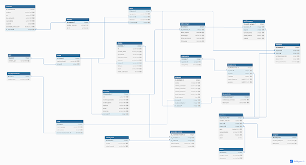

# Sistema de Gestión de Base de Datos - Colombina S.A.

Proyecto académico desarrollado en **PostgreSQL** para modelar los procesos de abastecimiento, inventario, comercialización y gestión administrativa de Colombina S.A., aplicando los principios del diseño de bases de datos relacionales, normalización e integridad referencial.

---

# Sobre la empresa

Colombina S.A. es una empresa colombiana fundada en el Valle del Cauca con más de 95 años de experiencia en la producción y comercialización de alimentos. Actualmente comercializa sus productos en más de 80 países y cuenta con un amplio portafolio que incluye confitería, chocolates, galletas, helados, salsas, conservas y otras categorías de alimentos.

El presente proyecto modela parte de sus procesos de negocio relacionados con la administración de productos, clientes, proveedores, compras, ventas, inventario, plantas de producción, empleados y accionistas.

---

# Diagrama Entidad-Relación

El diagrama del modelo entidad-relación se encuentra en la carpeta:

```
docs/
```

Puede visualizarse directamente a continuación:



> **Nota:** Cambie el nombre `MER.png` por el nombre real del archivo de la imagen.

---

# Estructura del repositorio

```
Proyecto-COLOMBINA-S.A
│
├── database
│   ├── schema
│   │     Script de creación de la base de datos.
│   │
│   ├── seed
│   │     Datos sintéticos para poblar la base de datos.
│   │
│   └── queries
│         Consultas SQL del proyecto.
│
├── docs
│     Documentación del proyecto y modelo entidad-relación.
│
├── README.md
├── LICENSE
└── .gitignore
```

---

# Tecnologías utilizadas

- PostgreSQL
- SQL
- pgAdmin 4
- Git
- GitHub

---

# Requisitos

Antes de ejecutar el proyecto se requiere:

- PostgreSQL instalado.
- pgAdmin 4 (opcional, recomendado).
- Una base de datos vacía donde se ejecutarán los scripts.

---

# Ejecución del proyecto

## 1. Crear la base de datos

Crear una base de datos vacía en PostgreSQL.

Por ejemplo:

```sql
CREATE DATABASE colombina;
```

Posteriormente conectarse a dicha base de datos.

---

## 2. Crear el esquema

Dirigirse a la carpeta:

```
database/schema
```

Ejecutar el script correspondiente al esquema de la base de datos.

Este archivo crea todas las tablas, restricciones, claves primarias y claves foráneas del proyecto.

---

## 3. Poblar la base de datos

Dentro de la carpeta

```
database/seed
```

se encuentran los archivos SQL que contienen los datos sintéticos.

Ejecutarlos en **orden numérico ascendente** para evitar problemas de integridad referencial.

Ejemplo:

```
01_...

02_...

03_...

...

08_ventas.sql
```

Cada archivo depende del anterior debido a las relaciones entre las tablas.

---

## 4. Ejecutar las consultas

Una vez cargada toda la información, ingresar a

```
database/queries
```

y ejecutar cada consulta SQL.

Todas las consultas deben retornar información correctamente si los pasos anteriores fueron ejecutados en el orden indicado.

---

# Datos sintéticos

Los datos utilizados en este proyecto fueron generados sintéticamente con apoyo de modelos de lenguaje (LLM), siguiendo criterios de consistencia e integridad referencial.

Los datos fueron diseñados para representar un escenario realista del funcionamiento de Colombina S.A., incorporando:

- Productos con diferentes niveles de popularidad.
- Clientes con distintos volúmenes de compra.
- Variaciones temporales en compras y ventas.
- Relaciones consistentes entre proveedores, productos e inventarios.

---

# Autores

Proyecto desarrollado como trabajo académico para la asignatura **Bases de Datos**.
